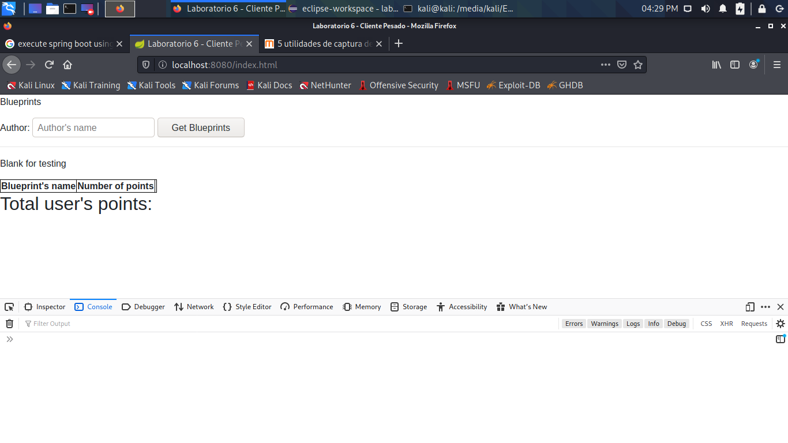
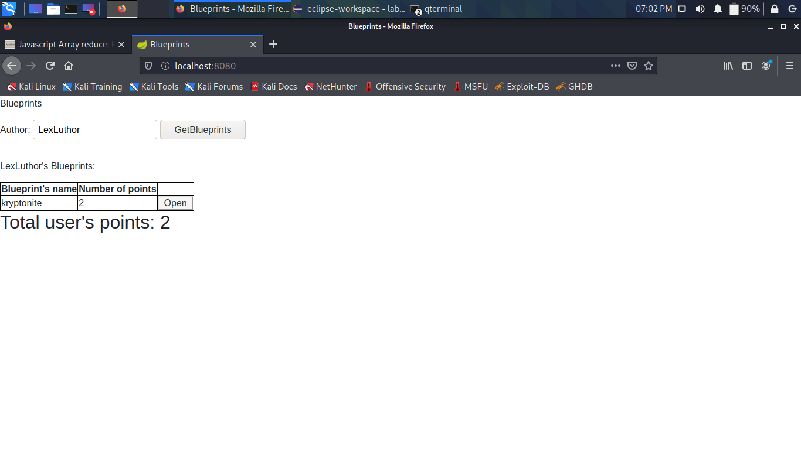
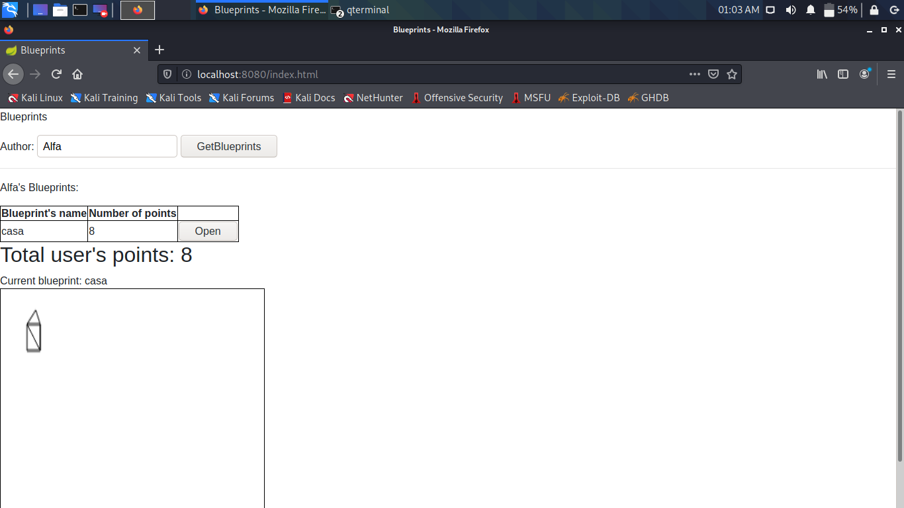
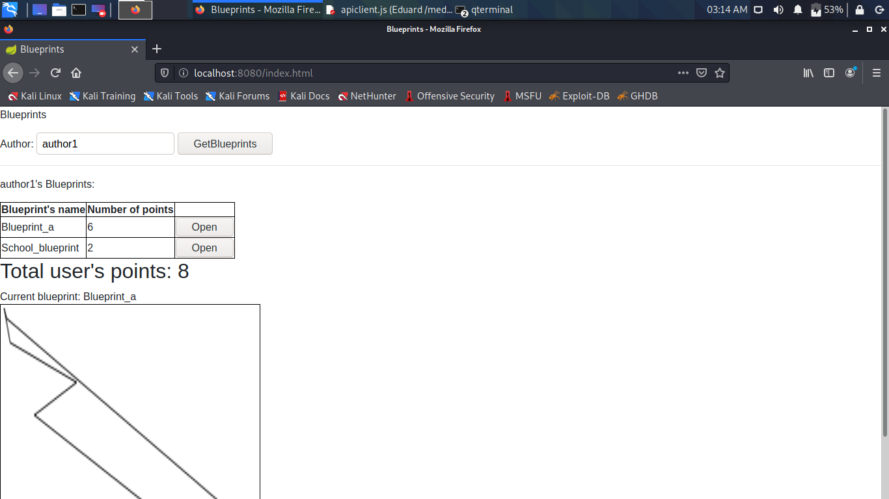

# ARSW LABORATORIO 6 - CLIENTES PESADOS

## Integrantes:

- Eduard Arias
- James Torres

## *PARTE I - ACTUALIZACIÓN DE BACKEND*

1. Se agregaron las dependencias requeridas según las instrucciones.
2. Se pensó en agregar el plug-in de springboot para gradle pero ya venía incluído en la dependencia compilada.

## *PARTE II - VISTAS*

1. Se creó una página web lo más parecida a los requisitos en las instrucciones; también se añadieron los enlaces de jquery y bootstrap en la cabecera.
2. Como es una aplicación basada en *Gradle*, usamos el comando `gradle bootRun` para arrancar el servicio.
3. Acceso desde `localhost:8080/index.html`

## *PARTE III - LÓGICA*

1. El patrón módulo de Javascript sirve para realizar encapsulamiento basado en "objetos", similar al que se ve en POO.
2. Al crear y asociar el servicio, queda de la siguiente manera:

## *PARTE IV - CANVAS*

** Utilizando el Mock de datos **

** Acoplamiento del API REST **

